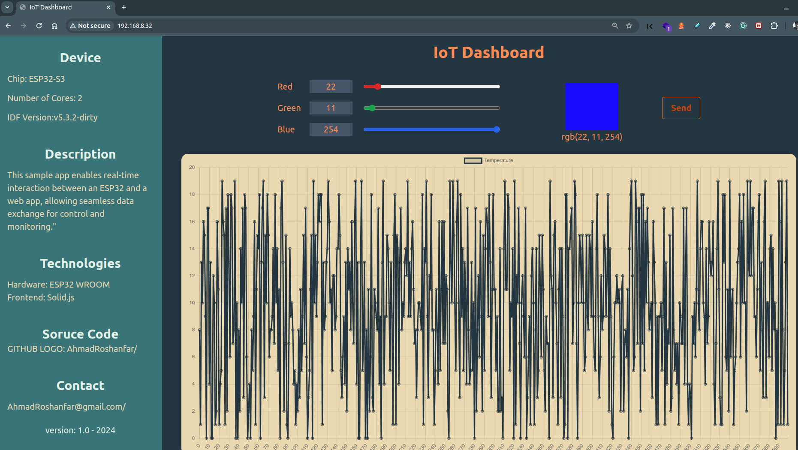

# ESP32-LED Server

This project implements a web application running on the ESP32-S3 to control an RGB LED using the RMT peripheral and monitor simulated sensor data in real-time charts. The frontend is built with Solid.js for a dynamic and responsive user experience.

[Youtube Link](https://youtu.be/hG_3ZQHvyVY)



## Running the Project

This code is based on the [restful_server](https://github.com/espressif/esp-idf/tree/master/examples/protocols/http_server/restful_server) example from Espressif.

### Clone the Repository

```bash
git clone https://github.com/AhmadRoshanfar/ESP32-LED_Server.git
cd ESP32-LED_Server
```

### Setup and Build the ESP32-LED Server Frontend

1. Navigate to the frontend directory:

   ```bash
   cd front/solid-front/
   ```

2. Install dependencies:

   ```bash
   npm install
   ```

3. Build the frontend:

   ```bash
   npm run build
   ```

4. Add the frontend build path to `main/CMakeLists.txt`:

   ```cmake
   if(CONFIG_EXAMPLE_WEB_DEPLOY_SF)
       set(WEB_SRC_DIR "${CMAKE_CURRENT_SOURCE_DIR}/../front/solid-front")

       if(EXISTS ${WEB_SRC_DIR}/dist)
           spiffs_create_partition_image(www ${WEB_SRC_DIR}/dist FLASH_IN_PROJECT)
       else()
           message(FATAL_ERROR "${WEB_SRC_DIR}/dist doesn't exist. Please run 'npm run build' in ${WEB_SRC_DIR}")
       endif()
   endif()
   ```

### Configure the Project

1. Run the configuration menu:

   ```bash
   idf.py menuconfig
   ```

2. Navigate to the following settings:
   - **Example Configuration** -> **Website Deploy Mode** -> Select **Deploy website to SPI Nor Flash**.
   - **Example Connection Configuration** -> Enter your WiFi SSID and password.

3. Set the target to `esp32s3`:

   ```bash
   idf.py set-target esp32s3
   ```

### Build, Flash, and Monitor

1. Build the project:

   ```bash
   idf.py build
   ```

2. Flash the firmware:

   ```bash
   idf.py flash
   ```

3. Monitor the serial output:

   ```bash
   idf.py monitor
   ```

### Tested Environment

This project has been tested with:

- **ESP-IDF Version:** 5.3.2
- **Target:** ESP32-S3

## Source Code

Find the full source code in the repository: [ESP32-LED_Server](https://github.com/AhmadRoshanfar/ESP32-LED_Server)

## Features

- RGB LED control using the RMT peripheral
- Real-time sensor data visualization in charts
- Responsive web interface built with Solid.js
